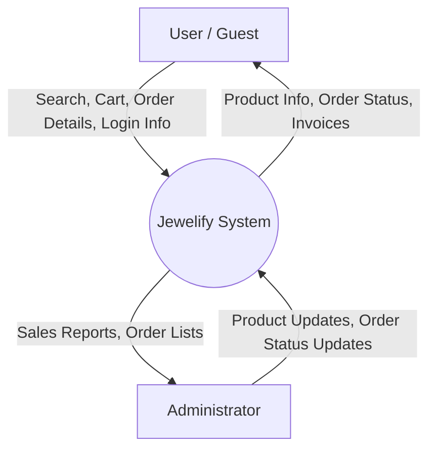
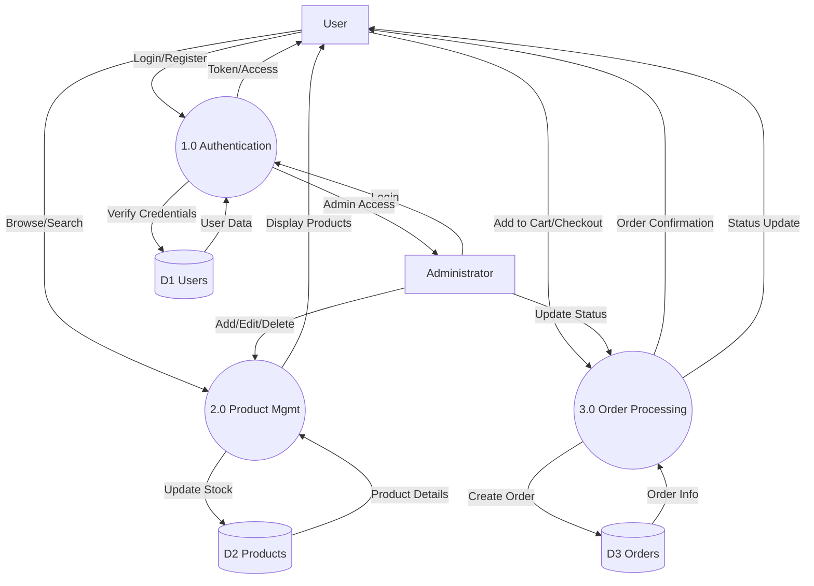
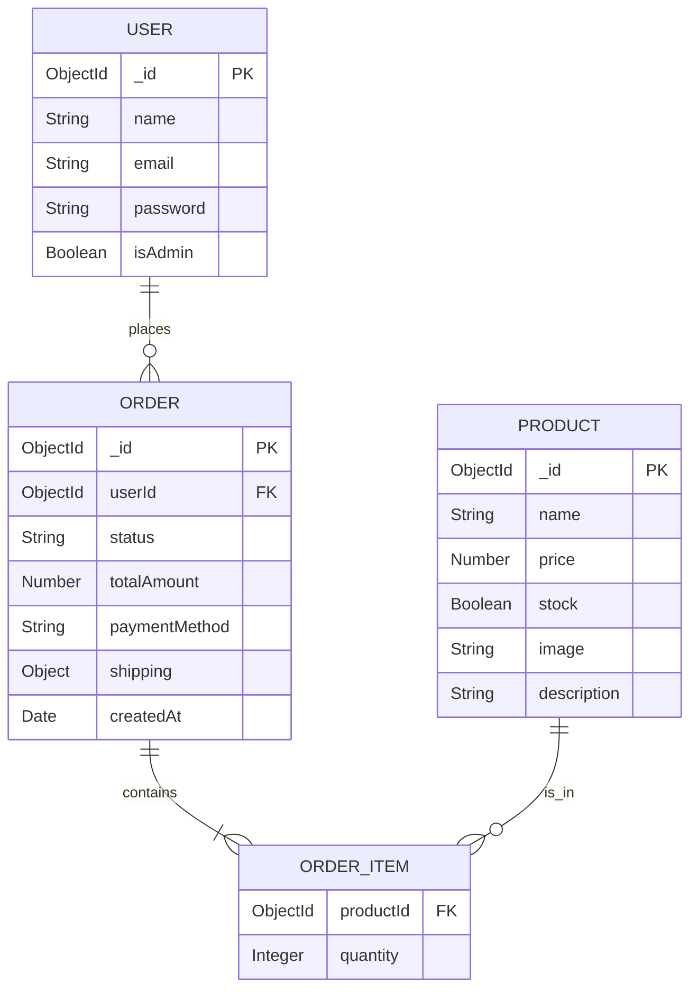
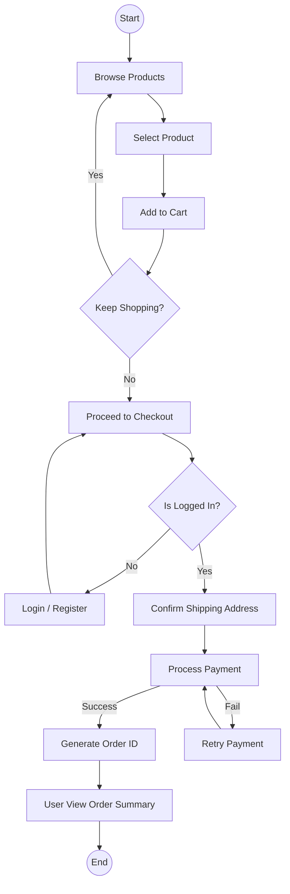

# Jewelify System Diagrams

This document contains the Data Flow Diagrams (DFD), Use Case Diagram, Entity-Relationship (ER) Diagram, and Activity Diagram for the Jewelify E-Commerce Platform.

---

## 1. Data Flow Diagrams (DFD)

### Level 0 DFD (Context Diagram)

The Level 0 DFD represents the entire Jewelify system as a single process interacting with external entities.

**Entities:**
*   **Guest/User**: Browses products, places orders, manages account.
*   **Admin**: Manages inventory, processes orders, views reports.



### Level 1 DFD

The Level 1 DFD breaks down the system into its main sub-processes.

**Processes:**
1.  **Authentication**: Handles login and registration.
2.  **Product Management**: Handles browsing (User) and CRUD operations (Admin).
3.  **Order Processing**: Handles cart management, checkout, and status updates.

**Data Stores:**
*   **D1**: Users Database
*   **D2**: Products Database
*   **D3**: Orders Database



---

## 2. Use Case Diagram

The Use Case Diagram defines the interactions between actors and the system's functionalities.

**Actors:**
*   **Guest**: Unregistered user.
*   **Registered User**: Logged-in customer.
*   **Administrator**: System manager.

```mermaid
usecaseDiagram
    actor "Guest" as g
    actor "Registered User" as u
    actor "Administrator" as a

    package Jewelify {
        usecase "Register" as UC1
        usecase "Login" as UC2
        usecase "View Products" as UC3
        usecase "Search Products" as UC4
        usecase "Manage Cart" as UC5
        usecase "Place Order" as UC6
        usecase "View Order History" as UC7
        usecase "Manage Products" as UC8
        usecase "Manage Orders" as UC9
        usecase "View Reports" as UC10
    }

    g --> UC1
    g --> UC2
    g --> UC3
    g --> UC4

    u --> UC2
    u --> UC3
    u --> UC4
    u --> UC5
    u --> UC6
    u --> UC7

    a --> UC2
    a --> UC8
    a --> UC9
    a --> UC10

    UC6 ..> UC2 : <<include>>
    UC5 ..> UC2 : <<include>>
```

---

## 3. Entity Relationship (ER) Diagram

The ER Diagram illustrates the database schema and relationships between entities.

**Entities:**
*   **User**: Stores customer and admin information.
*   **Product**: Stores inventory details.
*   **Order**: Stores transaction records.



*Note: In MongoDB, `ORDER_ITEM` is often embedded directly within the `ORDER` document as an array of objects.*

---

## 4. Activity Diagram

The Activity Diagram shows the flow of control for the **Order Placement Process**, which is the core business process.


